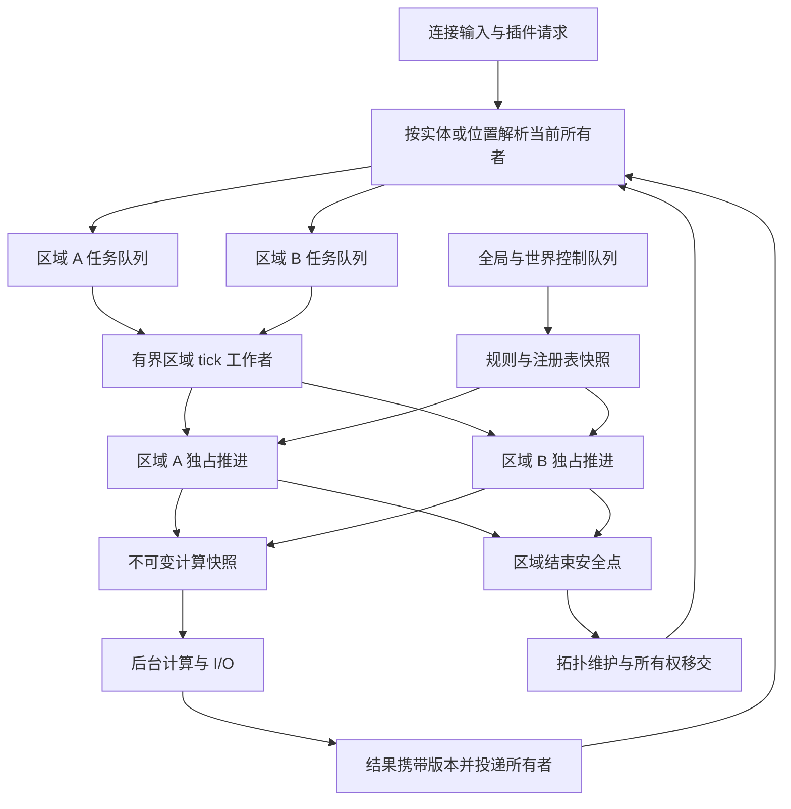

# FandServer 动态分区与多线程化企划案

日期：2026-09-05

状态：已开始 P0/P1 首批实施，详见[实施记录](REGIONIZED_EXECUTION_STATUS.md)；其余能力与数值目标仍属规划。

代码基线：当前工作区，Minecraft 26.2、Java 25；包含正在开发的指令同步与插件生命周期改动。

## 1. 项目目标与结论

将 FandServer 从“一个主线程推动所有世界”改为“多个独立区域并行推进，计算与 I/O 分阶段执行”的服务端。
世界的执行分区随区块加载、玩家分布、交互关系和实际负载动态调整；插件继续使用主要 Fand API，只迁移涉及执行线程与跨区数据访问的部分。

**已确认的兼容目标：保留主要 API 和方法签名，允许少量插件迁移。**

建议采用三层并行路线：

1. **区域之间并行**：独立区域的实体、方块实体、随机刻、方块和流体计划刻可以同时推进。
2. **区域内部计算并行**：逐项把适合的寻路、可见性计算、区块包准备等拆成“读取快照 → 后台计算 → 所有者验证并应用”。
3. **服务端系统并行**：区块生成、磁盘 I/O、网络编解码与区域 tick 分离，统一约束 CPU 和队列预算。

这里的“整个 Minecraft 多线程化”是让各个系统都有明确的并行策略，而不是允许多个线程同时修改同一个实体或方块。
同一组强关联状态仍需要有序提交；世界规则、插件注册和连接协议也有各自的串行边界。
如果坚持原版局部交互顺序，就不能同时承诺任意密集机器都能被无限拆分、所有旧插件零迁移，以及线程数翻倍性能必然翻倍。

第一版的产品承诺应当是：**分散负载可以扩展到多个 CPU 核心，独立区域可以隔离卡顿，局部玩法行为有回归测试约束。**
密集区域的进一步提速作为第二条研发路线，不能用区域数量或线程数量冒充实际收益。

## 2. 现状与必须改掉的设计

以下是当前源码事实；“建议改造”列描述未来工作，不表示已经完成。

| 当前实现 | 源码依据 | 建议改造 |
| --- | --- | --- |
| 所有世界仍由 `MinecraftServer.tickChildren()` 依次调用 `level.tick()` | [MinecraftServer.java](../fand-server/src/minecraft/java/net/minecraft/server/MinecraftServer.java) | 将运行控制与世界模拟分离，逐步替换为区域 tick 入口 |
| `ServerLevel` 持有世界级实体列表、方块/流体计划刻、邻居更新状态、爆炸缓存和 TNT tick 预算 | [ServerLevel.java](../fand-server/src/minecraft/java/net/minecraft/server/level/ServerLevel.java) | 明确每项状态的所有者、迁移规则和原有预算含义，不能仅将外层循环并行化 |
| 区块 tick、刷怪统计和距离管理仍汇聚在世界级结构中 | [ServerChunkCache.java](../fand-server/src/minecraft/java/net/minecraft/server/level/ServerChunkCache.java) | 拆分区块生命周期、区域模拟和世界级聚合统计 |
| 公开 `RegionScheduler` 是固定 8×8 区块的后台任务分道，相同分道串行，不拥有世界数据 | [RegionScheduler.java](../fand-api/src/main/java/io/fand/api/scheduler/RegionScheduler.java) | 保留原后台语义，新增真正的所有者调度入口 |
| 内部另有固定 8×8 区块的哈希任务调度器 | [RegionTaskScheduler.java](../fand-server/src/main/java/io/fand/server/chunk/RegionTaskScheduler.java) | 不把哈希命中同一线程当作世界数据所有权；后续收敛重复执行设施 |
| 主线程调度与部分 API 通过 `isSameThread()`、投递主线程、`join()` 串接 | [Scheduler.java](../fand-api/src/main/java/io/fand/api/scheduler/Scheduler.java)、[ServerThreading.java](../fand-server/src/main/java/io/fand/server/util/ServerThreading.java) | 改为所有权判断；tick 工作者不得同步等待另一个所有者 |
| 玩家传送已经返回 `CompletableFuture<Boolean>` | [FandPlayer.java](../fand-server/src/main/java/io/fand/server/entity/FandPlayer.java) | 保留签名，替换为跨区传送协议，并明确完成和失败时机 |
| 插件任务、配方、地图、协议、指令树发送、自定义方块 tick 集中在 `tickScheduler()` | [FandServer.java](../fand-server/src/main/java/io/fand/server/FandServer.java) | 分离全局注册表更新、按玩家发送和按区域执行的方块逻辑 |
| 事件在触发线程内同步分发，监听顺序已有定义 | [EventDispatcher.java](../fand-server/src/main/java/io/fand/server/event/EventDispatcher.java) | 保持单次事件内的顺序；允许不同区域的独立事件并行 |
| 区块加载与生成各自创建线程池 | [ChunkTaskExecutors.java](../fand-server/src/main/java/io/fand/server/chunk/ChunkTaskExecutors.java) | 加入区域 tick 后统一核算 CPU 使用，避免每个池都占满机器 |
| 已有区块跟踪快照、异步区块包准备 | [ChunkTrackingSnapshot.java](../fand-server/src/main/java/io/fand/server/chunk/ChunkTrackingSnapshot.java)、[AsyncChunkPacketSender.java](../fand-server/src/main/java/io/fand/server/chunk/AsyncChunkPacketSender.java) | 复用快照与有序应用的思路，补充区域迁移与连接代际检查 |

还有三处文档和术语问题：

- [原项目企划书](../PROJECT_PROPOSAL.md) 的目标版本仍写 26.1.2，而 [gradle.properties](../gradle.properties) 当前是 26.2。本案按实际构建版本规划，不直接移植其他版本的 tick 实现。
- [API 开发文档](API_DEVELOPMENT.md) 和 [自定义方块文档](CUSTOM_ITEMS_AND_BLOCKS.md) 当前承诺主线程访问。这是现有行为；区域版本发布时必须同步更新为所有者上下文，不能提前把未实现能力写成已支持。
- `io.fand.api.region.Region` 已表示有名称、范围和保护规则的玩法区域。本案把执行区域称为 **`TickRegion`**，不改变领地/保护 API 的含义。

## 3. 与 Folia 的关系

Folia 已经会把邻近区块合并，并在具备独立性时拆分区域；“动态分区”本身不是 Fand 独有的新增概念。
其关键约束是唯一归属、邻接缓冲和 tick 期间稳定的所有权。[Folia 区域逻辑](https://docs.papermc.io/folia/reference/region-logic/)

Fand 应借鉴所有权与区域调度模型，在自己的原版补丁体系和 Fand API 上实施。
是否复用具体代码要按目标 Minecraft 版本、依赖规模和相关文件许可证逐项评估；本案不假定 Folia 补丁能直接套用，也不引入 Bukkit 兼容层。

Fand 的额外目标是：

- 利用实际 tick 成本决定安全拆分、调度和批处理的时机。
- 针对已经形成的 Fand API 提供明确且小范围的迁移路径。
- 同步处理 Fand 的自定义方块、组件、指令树更新、插件动态重载等系统。
- 在区域并行成立之后，继续研究区域内部纯计算的并行化。

不要把“Folia 风格”理解成“所有对象自动线程安全”。Folia 自身也明确要求插件处理共享数据并迁移执行上下文。[Folia 插件兼容说明](https://github.com/PaperMC/Folia#plugin-compatibility)

## 4. 所有权模型

### 4.1 术语

以下是本提案使用的设计术语，尚不作为已发布 API：

| 术语 | 含义 |
| --- | --- |
| `OwnershipCell` | 固定坐标网格上的所有权管理单元，由若干区块组成；只在启动时选择粒度 |
| `TickRegion` | 当前共同推进的一组 cell，可动态拆分或合并，不要求矩形 |
| `RegionContext` | 本次执行持有的区域身份、所有权代际、局部时钟及区域数据访问能力 |
| `EntityOwner` | 实体当前归属；移动和传送时可以变化，不能由旧位置永久推断 |
| `WorldControl` | 世界级时间、规则、生命周期和聚合决策的逻辑所有者 |
| `GlobalControl` | 服务器生命周期、全局注册表和控制操作的逻辑所有者 |
| 所有权代际 `epoch` | 归属或生命周期改变时递增的标识，用来拒绝过期任务和结果 |

初版将 `WorldControl` 工作串行放在全局控制队列中，保留逻辑边界即可，不提前创建一套多余的线程和服务层。
同一 `TickRegion` 在不同 tick 可以由不同工作线程执行，**区域不是一条永久绑定的线程**。

### 4.2 数据归属清单

| 数据/操作 | 所有者 | 其他上下文的访问方式 |
| --- | --- | --- |
| 已加载区块的活动方块状态、方块实体、局部组件 | 所属 `TickRegion` | 按位置投递；查询大量数据时请求不可变快照 |
| 实体状态、AI 状态、乘客关系、玩家库存 | 实体所属 `TickRegion` | 实体调度器跟随归属；跨实体修改先确定参与者 |
| 方块/流体计划刻、邻居更新队列、局部随机源 | 所属 `TickRegion` 或其中的稳定 cell | 在拆分/合并安全点迁移，不通过共享可变集合兜底 |
| 双箱、漏斗、容器与玩家菜单交互 | 参与对象共同拥有的执行范围 | 先取得兼容的所有权范围再执行完整交互 |
| 区块票据、加载状态、POI 索引 | 按位置划分的数据所有者与区块生命周期协调器 | 状态机推进；加载 Future 完成不等于任意线程获得修改权限 |
| 时间、天气、世界边界、游戏规则 | `WorldControl` | 修改发往控制队列；区域在 tick 开始取得一致版本 |
| 世界刷怪上限、睡眠统计、袭击/龙战等聚合状态 | 按系统明确指定世界控制者或空间所有者 | 快照、名额预留和有序决策；不能把总上限复制给每个区域 |
| 命令、配方、标签、服务、权限定义等注册表 | `GlobalControl` | 构建并原子发布不可变版本，区域读取快照 |
| 计分板、跨区域地图/玩家列表索引 | 全局或世界逻辑所有者 | 异步修改与版本化快照；具体服务逐项适配 |
| 网络连接状态与发送顺序 | 连接事件循环/连接协议状态机 | 区域产生不可变消息，交给连接队列发送 |
| 插件自己保存的共享状态 | 插件自行定义的所有者或并发结构 | Fand 的区域所有权不自动保护插件字段 |
| 存档写入和文件队列 | 存储子系统 | 所有者产生一致快照，按文件/记录顺序提交 |

所有权清单必须深入到 `ServerLevel`、`Level`、`ChunkMap`、`DistanceManager`、实体管理器以及静态工具缓存。
公开 API 加一层线程检查，无法修复 NMS 内部仍共享同一个可变队列的问题。

### 4.3 执行结构



## 5. 动态分区设计

### 5.1 固定管理粒度，动态执行范围

建议原型比较 2×2、4×4、8×8 区块的 cell 粒度，暂以 4×4 为实验起点；这不是性能结论，也不是区域大小上限。
负坐标必须使用向下取整。cell 粒度运行时不改变，避免所有坐标键、任务路由和索引同时失效。

动态变化的是 cell 属于哪个 `TickRegion`、区域何时运行以及哪些独立任务被批量调度。
例如，远离的两个玩家活动区可以分开 tick；两者之间加载的区块及交互缓冲连成一片时合并；连接消失并满足独立性条件后再拆分。
只看玩家距离不够：强制加载、实体、区块票据、机器和加载中的数据都影响边界。

### 5.2 必须成立的不变量

1. 每个活动 cell/区块只有一个有效所有者；每个可 tick 实体只有一个有效执行归属。
2. 一个区域同一时刻最多执行一个会修改其状态的任务段。
3. 执行中的区域不能临时抢占正在被其他区域使用的数据。扩张、拆分、合并在参与区域静止的安全点完成。
4. 局部同步机制所需的邻接范围必须包含在可访问所有权中；缓冲距离来自访问路径审计，不能当作任意 API 的通用安全距离。
5. 任务使用位置或实体身份解析当前归属；拓扑变更不能令已提交任务永久停在废弃队列。
6. 区域内多对象的一次原子修改不能因调度切换变成半完成状态。

这些是正确性条件；负载均衡只能在满足它们的可行范围内优化。

### 5.3 拓扑状态与迁移

建议状态为 `PREPARING → READY → RUNNING → READY`；拓扑调整时从静止状态进入 `RECONFIGURING`，完成后产生新的 `READY` 区域并使旧身份 `RETIRED`。
所有参与者都停止执行后才能发布新映射；某个区域仍在运行时记录调整意图，不能阻塞另一个工作线程等待它。

每次拓扑调整至少处理：

- cell 与实体归属、局部 tick 列表、方块实体、邻居更新与 block event 队列。
- 任务队列及取消句柄、到期时间、实体跟随任务、区块票据与加载完成回调。
- 区域缓存、待应用计算结果、玩家跟踪信息、所有权代际和监控标识。
- 加载/卸载中的区块与传送中的实体；它们必须有明确的临时所有者。

先在不可运行的新结构中完成分配，再发布所有权映射并重新入队。
迁移失败应在未发布前保留旧归属；发布后禁止通过捕获异常继续使用两套数据。
旧句柄转发只作为有寿命的内部过渡机制，不能积累无限转发链。

### 5.4 负载自适应策略

记录每个区域 tick 用时的移动平均、p95、超期程度、队列积压、cell 数量，以及跨区请求量和迁移成本。
热点定位需要抽样记录 cell/任务类别的成本，但不要在每次方块访问时添加计时器。

| 观测 | 调整 |
| --- | --- |
| 独立区域数量多，且存在空闲工作线程 | 按下次执行时间和等待程度分配，允许区域在 tick 之间更换工作线程 |
| 一个区域较重，并包含可以安全分离的部分 | 在安全点拆分，分别维护运行周期 |
| 邻近区域发生持续、同步的强交互 | 为保证语义合并，接受区域可能变大 |
| 大量很轻的独立区域导致调度开销过高 | 批量领取多个区域任务，保持各自所有权和时钟；无需为了减少队列操作迁移世界状态 |
| 某个区域已经不可安全拆分但仍超期 | 报告具体系统热点，进入区域内部计算优化；不按 CPU 指标强行切开 |

拆分采用持续观测、收益估计与冷却时间；合并后的负载再高也不能破坏独立性要求。
初始实验可用“连续数秒超过目标预算才评估拆分、非必要拓扑优化冷却约十秒”，随后由压测调整。
**正确性所需的合并不受性能冷却时间限制**，不能为了防抖让不安全的相邻区域继续并行。

最大区域大小只能是运维提示或优化目标，不能成为破坏交互正确性的硬切割条件。
持续加载且互相连接的城区可能形成一个很大的区域，这属于该模型的明确限制。

### 5.5 调度与时钟

区域独立调度，正常目标为每秒 20 tick；超期区域不要求其他独立区域等待同一个全服 tick 屏障。
卡顿隔离的前提是仍有可用 CPU、全局服务没有成为瓶颈，以及区域没有重新合并。

区分墙钟延迟、区域 tick 延迟、世界游戏时间和服务器控制 tick；不要把这些全部映射到一个计数器。
Folia 为区域维护局部时钟，并在合并时平移局部截止时间、拆分时继承时钟。[Folia 时间模型](https://docs.papermc.io/folia/reference/overview/#tick-counters)

Fand 的建议规则如下：

- 局部计划刻按区域的模拟时间计数，保证原有相对延迟。合并时对相应时钟使用 `newDue = oldDue + targetNow - sourceNow`。
- 拆分继承父区域相应时钟；同到期时间的任务仍有稳定顺序，不能把旧区域不相关的序号直接当作全局唯一值。
- 世界时间、天气等在区域 tick 开始读取一致版本。26.2 已存在 `clockManager` 等路径，需要按实际实现审计，不能只照搬旧版本字段名。
- 实体跟随任务以实体经历的局部模拟 tick 计算 tick 延迟；移交时转换剩余 tick。`Duration` 使用单调时钟表示最短等待，不受区域合并影响。
- 冻结、单步和变速必须明确作用于世界、区域还是服务器控制时钟。跨区域移交时同时定义冻结状态，避免实体借移动多执行一次。

红石和其他局部机制以区内顺序为兼容目标。分区之间不承诺与单线程服务器完全相同的总事件顺序或逐位一致的随机序列。

## 6. 跨区交互：先解决语义，再决定并行方式

### 6.1 三类操作

| 操作类型 | 示例 | 执行规则 |
| --- | --- | --- |
| 单所有者 | 修改本区方块、推动本区实体 AI | 直接同步执行，保持当前方法签名与局部顺序 |
| 可以分阶段 | 传送、远程快照查询、加载后放置实体 | 显式异步协议；每一阶段只修改当前所有者数据 |
| 需要同步联合状态 | 活塞链、漏斗转移、双箱操作、相互伤害、跨边界爆炸 | 在执行前确保参与范围共同受控；初版优先扩大或合并区域 |

不能把邻居更新统一变成“发消息，下个 tick 再处理”。这会改变红石时序、容器原子性和碰撞结果。
也不能在区域 A 正在执行时，用阻塞 `join()` 等待区域 B，特别是 B 可能反向等待 A 的情况。

### 6.2 边界的实现要求

正常空间交互由区块缓冲、邻接合并和加载票据尽量提前覆盖。
对长距离爆炸、命令批量编辑等范围可知的操作，在修改之前申请所需范围；申请尚未就绪时保存操作意图，稍后在安全上下文执行。

无法预先界定范围、又会在执行中产生链式副作用的机制，必须逐条审计：证明访问被现有归属覆盖，或改成具有明确安全阶段的实现。
**如果已经改了一半世界才发现越界，不能靠异常、事后合并或通用回滚来补救。**
该机制在覆盖证明或专用协议完成前，不进入多区域发布范围。

这项限制意味着：首个原型可以验证分散区域并行，但支持完整玩法的版本必须经过边界机制的单独准入检查。
保护原版行为的具体范围以兼容测试矩阵公布，不能只写“原版完全兼容”。

多区域短事务可作为后续专用机制研究：参与者按固定顺序申请安全点预留，取得全部预留后执行，最后释放。
初版不公开任意多区事务 API，不构造覆盖所有 NMS 操作的通用分布式事务框架。

### 6.3 实体移动与传送

自然移动应尽可能落在已经预留的邻接所有权内；需要移交时在区域安全点改变归属。
远距离/跨维度传送采用有身份的操作状态机：

1. 在源实体所有者上检查实体仍存在，触发可取消的准备事件，记录传送操作 ID。
2. 异步准备目标区块、目标区域和必要的放置条件；等待期间不让后台线程读取源实体可变字段。
3. 回到源所有者重新检查操作 ID、实体生命周期、位置条件和乘客关系；正式移交时暂停该实体组的模拟与交互。
4. 从源索引解除有效执行归属，将实体组交给明确的传输所有者，再由目标区域接收并安装。
5. 发布目标实体归属，恢复实体任务，按连接协议发送结果，最后完成 Future。

一个实体不能在两边同时 tick，也不能在暂停期间被其他库存/伤害路径继续修改。
乘客与载具按照一个移交单元处理；不能只传送根实体并遗漏其附属关系。

失败分阶段处理：提交前取消并释放目标票据；离开源以后按已记录状态恢复源或完成目标安置，不能仅返回 `false` 并遗留实体。
断线、死亡、重复传送、目标世界卸载与关闭服务器都必须有终止路径。
Future 完成表示服务端归属与安置已提交，不等同于客户端已经确认画面更新。

### 6.4 跨区查询

同步读取实时数据只对当前所有者有效。获取其他区域的数据通过异步快照或在目标所有者上执行查询。
全世界搜索按区域分发，再汇总不可变结果；结果携带采样时间/版本，不宣称来自同一个瞬间。
跨区一致快照需要专门协调，在低频管理操作中提供，不能成为每个 getter 的隐形成本。
快照必须复制需要跨线程使用的值；不可变列表里装着可变实体或物品句柄，不等于其中的数据也可安全读取。

## 7. API 保留与插件迁移

### 7.1 兼容承诺分层

| 兼容维度 | 目标与边界 |
| --- | --- |
| 主要类型与包结构 | 保留 `World`、`Entity`、`Player`、`Block`、`Inventory`、事件与服务的主要表面 |
| 同步方法签名 | 能在单所有者内完成的方法尽量保持；调用者必须在正确上下文 |
| 已有 Future 方法 | 尽量保持签名，将内部主线程投递改为所有者协议 |
| 线程语义 | 明确变更：同步表示当前所有者上下文，不再表示全服务器唯一主线程 |
| 插件内部状态 | 插件需要迁移跨区域共享字段和跨服务调用，不能由平台保证零修改 |
| 二进制兼容 | 每次发布检查旧插件字节码和公开签名；有意破坏必须列迁移项并按版本策略发布 |

新增 API 应当尽量集中在调度、不可变快照和明确的跨区操作，不把所有方法都机械地改成 Future。
带同步返回值的跨区方法无法靠保留签名免费实现；要么限制到所有者内，要么增加异步替代方法。
现有 `void` 自动投递方法也要逐项明确是否保持提交语义，不能同名方法时而同步、时而无提示地延后修改。

### 7.2 调度 API 草案

以下为语义示例，**不是当前可编译 API**；命名和返回类型在 P1 原型时确定。

```java
// Execute with ownership of the target location.
context.scheduler().at(location).run(() -> updateBlock(location));

// Follow entity ownership across movement and teleportation.
context.scheduler().forEntity(player).run(() -> updateInventory(player));

// Modify global state without acquiring world ownership.
context.scheduler().global().run(() -> updateGlobalRegistration());

// Keep independent background work explicit.
context.scheduler().runAsync(() -> loadExternalData());
```

每个位置/实体入口同时支持带结果的查询，以及按 `Duration` 和局部 tick 延迟的任务；返回的句柄纳入插件资源追踪。
实体已移除、世界已卸载、插件已停止时，任务必须取消或以明确定义的结果失败，不能永远挂起。
用户任务只捕获 API 句柄或不可变输入，不捕获将跨越执行阶段使用的 NMS 可变对象。
普通 Future 的完成回调不授予所有权；即使一次回调恰好在区域线程执行，也不能依赖这一点。
回调需要继续修改世界时，再显式投递给位置或实体所有者。取消只能阻止尚未提交的工作，不能承诺撤销已经完成的世界修改。

位置任务执行前重新解析坐标归属，实体任务执行前重新解析实体归属。
实体调度不能用“取得玩家当前位置，再调用位置调度”模拟，因为玩家可能在排队期间离开。
Folia 的开发文档也区分位置调度与跟随实体的调度。[Paper/Folia 调度说明](https://docs.papermc.io/paper/dev/folia-support/#schedulers)

现有 `RegionScheduler` 保持 8×8 背景任务分道语义，在文档中清楚标注为后台设施。
可在后续版本增加语义更清楚的别名并弃用旧名称；不能直接把它改成区域 tick 调度，令原有阻塞后台任务突然卡住世界。

### 7.3 `runMain` 的处理

建议明确区分启动模式：

- `legacy`：现有主线程执行模型与 `runMain*` 行为保持。
- `regionized`：使用新的所有者调度 API。旧 `runMain*` 在提交时报告不支持，并给出迁移方向。

不把 `runMain` 默默映射到全局控制队列，也不根据调用线程猜测它想访问哪个世界对象。
需要改世界的任务换成 `at(...)` 或 `forEntity(...)`；操作全局服务的任务换成 `global()`。
这是一处明确的行为兼容变化，必须列入插件迁移指南和发布说明。

`legacy` 初期用于现有插件运行和对照测试；不建设长期双份玩法实现。
新所有权内核稳定后，再评估能否用覆盖全服务器的单一执行域实现兼容模式，同时证明旧顺序和 API 契约仍成立。
切换模式要求重启，不提供运行中一键切换。

### 7.4 插件声明与公共元数据

建议在 `fand-plugin.json` 增加可选的并发能力元数据，例如 `threading: "regionized"`；缺省表示只承诺旧执行模型。
它是作者声明，不是平台自动验证通过的证明。

区域模式启动前列出不满足能力要求的插件和依赖链，并明确终止启动或要求管理员调整插件集合。
不能悄悄跳过核心插件后宣称服务器正常启动；也不能给旧插件加一把锁就宣称它可以任意跨区访问。
动态加载时在插件启用前完成同样检查，失败应返回准确原因。

当前 `PluginDescriptor` 是公开 record，直接增加 record component 会改变其构造与反射形状。
优先把新增线程能力放在内部解析的独立元数据中，通过独立只读能力入口公开；若确需修改 record，必须按显式 API 迁移处理。
新增接口方法优先采用兼容的扩展方式，并使用编译好的旧插件验证，不能只重新编译示例插件作为 ABI 证据。

### 7.5 事件、命令与组件

- 单次可取消事件仍在动作发生的所有者上按原有优先级同步执行，决定产生前不能把修改提前提交。
- 两个独立区域的事件可以同时调用同一插件。监听器实例里的集合、缓存、计数器和跨插件服务调用需要明确同步策略。
- 玩家命令在玩家所有者上执行，控制台命令在全局控制上下文执行。命令涉及其他区域时显式调度；全局上下文没有任意世界读写权限。
- 普通局部选择器在所有者内执行；`@a`、跨世界 `@e`、`execute` 链、数据包函数和命令方块的跨区行为必须单独设计。要求同步结果的命令链不能静默变成异步后仍声称原样兼容。
- 指令注册和卸载发布新的命令树版本，再给在线玩家的当前所有者投递同步任务，并通过连接队列发送。动态重载不能让旧版本覆盖新树，卸载也必须触发更新。
- 补全回调执行上下文必须有契约。基于命令元数据的补全可读取快照；查询世界的补全通过所有者任务获取结果，不在网络线程阻塞等待。
- 自定义方块 tick 和持久组件转到其区域所有者。不可变配置可以跨区域共享，可变组件只能通过所属对象访问。
- 数据包/标签/配方重载在受控安全点安装新版本，避免一个动作混用两个版本的规则。

### 7.6 插件重载与卸载

多线程以后，注销监听器不代表已经开始执行的回调已经结束。需要在现有资源追踪之上增加插件生命周期代际与在途执行计数：

1. 将插件标记为停止接收任务，撤销新回调的进入权限。
2. 取消尚未开始的任务，撤销注册项并发布新的快照版本。
3. 等待已经进入的受平台管理回调到达结束点；等待在控制流程中异步进行，不占用区域 tick，也不持有插件生命周期锁等待回调。
4. 执行约定的关闭流程，完成存储刷新与资源释放，再允许替换类加载器和启用新实例。
5. 旧代际产生的延迟回调、计算结果和注册句柄不得修改新实例的状态。

从插件自身回调触发的卸载必须作为请求延后完成，不能同步等待自己退出。
超时应显示阻塞的插件和任务，保留可诊断状态；不强制停止线程，不假装卸载完成。
平台只能追踪通过受管理入口运行的任务；插件私自创建且不结束的线程会阻止可靠卸载，这种情况不能承诺强制热重载。

## 8. 把各系统逐步多线程化

| 系统 | 第一阶段策略 | 后续并行空间 | 主要限制 |
| --- | --- | --- | --- |
| 实体、AI、碰撞 | 区域之间并行，区内保持更新顺序 | 独立寻路/感知候选计算 | 实体状态、随机源、碰撞和目标选择必须由所有者应用 |
| 红石、流体、活塞、邻居更新 | 关联区域内有序推进 | 优化热点算法与无副作用计算 | 不以跨区消息延迟改变原版顺序 |
| 方块实体、容器、自定义方块 | 按区域执行 | 不互相作用的独立区域自然并行 | 库存交换、配方结果和组件写入必须原子 |
| 随机刻、刷怪 | 本地工作分区；统计和名额有指定所有者 | 聚合快照与受控名额分配 | 不能把世界级刷怪上限乘以区域数；确有语义变化需公开 |
| 区块加载/生成/光照 | 保留异步流水线，审计状态发布和邻区依赖 | 按阶段调度与取消过期工作 | 生成中的邻接数据不等于活动区块可被并发修改 |
| 区块与实体网络同步 | 在所有者捕获数据，后台准备不可变载荷 | 编码、压缩、可见性计算 | 连接顺序、移交代际、实体销毁与生成包顺序 |
| 存档 | 所有者产生快照，后台有序写盘 | 压缩与独立文件 I/O | 快照一致性、同一区域文件并发写入和移交中的实体 |
| 地图、计分板、全局服务 | 一个逻辑所有者更新，发布快照 | 分块计算或按业务键分片 | 跨键原子操作和持久化顺序 |
| 插件业务 | 区域回调并行；异步 I/O 独立 | 插件自行划分状态所有者 | 不能自动修复第三方插件内部竞争 |

计算卸载必须能证明净收益：快照构建、内存分配、版本验证和结果丢弃都会消耗时间。
验证同时包含所有权代际与相关输入数据版本；区域没有拆分并不代表地形、实体目标或库存仍与计算开始时相同。
首先选择 profiling 显示明显占用 CPU、且输入能稳定截取的路径；不一次性把整个 AI、爆炸或实体 tick 改成 Future 链。
如果过期结果频繁被丢弃，应缩短计算范围或回到所有者同步计算，不能关闭版本校验硬套结果。

TNT 限额、刷怪额度等原来的世界级限制不能直接复制成每区同样的额度。
应明确保持世界总额、调整为按区域的产品规则，还是移除该限制；每一种都需要单独的行为决定和测试。
本案不借多线程改造恢复已暂停的红石 JIT，也不混入与线程模型无关的玩法优化。

## 9. 线程预算、过载与故障处理

区域 tick、世界生成和后台 CPU 计算使用共同的容量预算，I/O 阻塞任务与 CPU 工作者分开管理。
不要求所有系统挤进一个线程池，但不允许每个系统自行按全部逻辑核心数创建满额工作者。
Java 虚拟线程可用于适合的阻塞 I/O，不能作为增加实体 tick CPU 并行能力的替代方案。

初版保留少量明确配置：执行模式、tick 工作者预算、后台 CPU 预算、I/O 并发上限和诊断开关。
cell 粒度与动态调整阈值放在实验配置中，经数据验证后再决定是否公开，避免提供几十个无法正确调节的参数。

所有可无限增长的外部请求队列应有背压。区域任务数量、插件提交量、区块准备和快照请求分别可观测。
过载时拒绝新的可拒绝请求或限制发起速率，并返回明确失败；不能静默丢弃已经接受的世界修改。

当前用户要求清理防御性代码，应贯彻到新架构：

- 删除吞异常后假成功、无原因 `return`、双份可变状态和永不触发的兼容分支。
- 将所有权检查放在 API、NMS 关键入口和调度移交边界；内部已经持有有效上下文的紧密循环不重复验证同一事实。
- 过期结果检查、单所有者约束和队列生命周期检查属于必要正确性边界，保留并让失败能定位到来源。
- NMS 状态不变量被破坏后停止相关模拟并进入明确故障流程。不要捕获所有异常后继续推进可能已经损坏的世界。

运行时诊断至少显示：区域 ID/代际、区块范围、玩家数、tick 用时与超期、队列长度、合并/拆分原因、跨区等待、后台结果过期率。
异常带上当前所有者、目标所有者、插件 ID 与操作 ID，不为排查问题再维护一套不一致的“影子状态”。

## 10. 存档、世界卸载与关闭服务器

保留现有世界文件格式为首选，运行时区域 ID 不写成世界永久身份。
区域布局在加载时重建，持久任务和实体不能依赖上一次启动的区域 ID。

日常保存由各数据所有者产生一致快照，再交给存储队列；压缩和磁盘写入可以并行，同一文件/记录的写入仍有顺序。
跨区域普通快照不等于全世界同一 tick 的快照，需要一致备份时提供显式协调保存。

世界卸载的顺序是：拒绝新进入请求 → 阻止新票据 → 结束或取消跨区移交 → 停止该世界区域接收工作 → 等待安全点 → 保存 → 撤销索引。
关闭服务器还需要汇总未完成传送、插件刷新和后台存储请求，不能只等待“主线程退出”。

首版建议在保存快照捕获的短窗口暂停相关实体移交，使实体恰好出现在一个有效保存位置。
这能约束正常保存，但不能直接解决进程在多文件写入之间崩溃的问题。
必须用崩溃注入验证传送前后实体的恢复行为；如果现有存储路径不能避免重复/丢失，则需要带幂等恢复规则的持久移交记录，再讨论生产可用。
增加恢复记录只针对已证明存在的多步持久化问题，不提前建设通用事务数据库。

回退采用停止服务器、确认保存完成、以兼容版本重启的方式。
涉及新持久元数据时需要版本标记和旧版本处理规则；初期在存档副本验证，禁止承诺任意运行时切换和任意二进制降级都安全。

## 11. 实施阶段与验收门槛

本案建议按原项目的个人全职开发假设估算。以下是规划区间，不是交付承诺；每阶段结束后按发现的问题重新估算。
如果同时追赶新的 Minecraft 版本、维护其他功能或缺少稳定测试机器，时间还会增加。

| 阶段 | 交付物 | 进入下一阶段的条件 | 粗估投入 |
| --- | --- | --- | --- |
| P0：基线与状态审计 | tick 调用图、共享状态清单、API 访问分类、机器/插件测试集、性能基线 | 主要可变状态有归属草案；选定首批完整支持的玩法；现有行为有对照 | 2–4 周 |
| P1：所有权内核，保持串行 | `RegionContext`、位置/实体调度原型、生命周期代际、单执行域运行 | 单执行域通过原有功能回归；无跨所有者阻塞设计；旧插件二进制对照可运行 | 3–6 周 |
| P2：基础区域并行 | 区域数据拆分、tick 工作者、保守拓扑规则、加载发布与初步移交 | 两个独立区域确实同时推进；基础实体移动和区块加载无重复所有者；不依赖全服每 tick 屏障 | 6–12 周 |
| P3：完整边界与动态调整 | 拆分/合并迁移、时钟转换、复杂传送、容器/红石边界、保存关闭 | 边界矩阵与故障注入通过；动态调整不改变局部机器行为；没有实体/库存重复或丢失 | 8–16 周 |
| P4：Fand API 与插件系统迁移完成 | 服务所有权、并发事件、命令/补全、组件、插件声明与热重载、迁移文档 | 代表性插件功能迁移量可统计；加载/卸载/重载全链路通过；已知不兼容项公开 | 4–8 周 |
| P5：热点计算卸载 | 按 profile 选择的少数纯计算优化、CPU 预算整合 | 每项优化收益覆盖快照成本；没有用语义变化掩盖性能回退 | 4–10 周，按收益可推迟 |
| P6：长期运行与发布 | 压测报告、运维指标、兼容清单、回退演练、上游升级演练 | 连续稳定运行、保存恢复正确、边界缺陷关闭或明确阻断发布 | 4–8 周 |

从 P0 开始就持续加入插件和保存测试，P4/P6 是完成门槛，不是到那时才首次考虑它们。
完整顺序投入约 31–64 人周，约 7–15 个月；达到生产标准可能更久。
最先可评审的所有权原型约在 P0–P1，即 5–10 周；这还不是“Minecraft 已经全多线程”。

对于单人开发，建议把 P3/P4 的稳定区域版本作为第一次正式产品目标，P5 根据收益独立推进。
增加开发者可以让测试设施、API 迁移和部分系统审计并行，但核心所有权模型与 NMS 迁移存在依赖，工期不能简单除以人数。

### 11.1 首批实现任务

1. 对 `MinecraftServer.tickChildren()`、`ServerLevel.tick()`、`ServerChunkCache.tick()` 建立调用与状态归属清单。
2. 将 `ServerThreading` 及公开 API 调用分为同所有者同步、异步请求、不可变读取、需要重新设计四类，特别标出 `join()` 和自动投递。
3. 引入内部所有权上下文，以单执行域跑通现有行为；先验证边界，再改并行。
4. 加入位置与实体调度的最小 API 原型，在现有串行运行模式下验证未来插件写法。
5. 为区域合并/拆分建立不依赖完整服务器的模型测试，再接入实际世界数据。
6. 选择两个远离且没有交互的加载区域，完成一次真实的并行 tick 原型与对照压测。

这一批只验证基础架构。不要把 P0–P2 膨胀成所有 API 重写、所有集合替换或一次性重构整个仓库。

### 11.2 源码与补丁边界

新增 Fand 调度、状态模型和测试放在正常模块目录。
NMS 改动只编辑 `fand-server/src/minecraft/java/**`，使用既定内层 Git 与 paperweight 再生成补丁流程，不直接编辑 `fand-server/patches/**`。
具体提交和推送按仓库现有授权规则执行；这份企划案不构成任何提交或发布授权。
保持逻辑改动可独立审阅，避免形成一个涵盖所有线程改造的巨型补丁。

## 12. 验证与性能指标

### 12.1 正确性矩阵

| 场景 | 必须验证的性质 |
| --- | --- |
| 固定输入、单执行域对照 | 保留局部事件、任务和原版更新顺序；区分既有 Fand 行为与新变化 |
| cell 边界、区域边界、负坐标 | 坐标路由正确；无双所有者、遗漏 tick 或非法读取 |
| 活塞、观察者、比较器、红石链、流体 | 放置在边界与区域中心时，约定的局部输出与时序一致 |
| 漏斗、双箱、GUI、交易、玩家库存 | 并发操作时物品数量守恒，无复制、丢失或半次交易 |
| TNT 连锁、实体碰撞、弹射物、伤害 | 范围访问有合法所有权；一次效果只应用一次 |
| 移动、载具、乘客、传送门、重生 | 每个实体最多 tick 一次；不存在同时位于两区的有效实例 |
| 刷怪、村民/POI、袭击、龙战、睡眠 | 世界级规则没有按区域重复执行，空间状态迁移完整 |
| 加载/卸载与异步生成完成交错 | 已卸载世界不被旧回调重新激活；票据和任务最终释放 |
| `/tick` 冻结、单步、变速与拓扑调整 | 时钟域正确，计划刻相对延迟保持，移交不会绕过冻结 |
| 指令、选择器、函数、命令方块与补全 | 执行上下文与结果语义明确，重载/卸载后所有在线玩家收到新树 |
| 插件事件中请求自卸载、级联重载 | 不死锁；旧代际回调不进入新实例，失败状态真实可见 |
| 存档、卸载、关服时发生跨区传送 | 实体归属和持久化能够恢复；不出现挂起 Future、重复实体或未落盘状态 |
| 中途异常、进程崩溃与重启 | 恢复操作幂等，能定位未完成步骤，不能依赖正常关服才能保持正确 |

对依赖随机行为的测试，固定种子还不够；必须固定采样范围和执行顺序，或验证分布/守恒性质。
跨独立区域的总事件顺序允许变化，不拿逐条全服日志完全相同作为无法实现的验收条件。
新增所有权原语使用高竞争与随机调度测试；真实 NMS 行为必须有服务器集成测试，不能只依赖 mock。

### 12.2 性能矩阵

至少覆盖：单一密集城区、多个分散玩家群、多个维度、连续探索生成、红石机器、实体农场、插件繁忙和空服。
记录硬件核心拓扑、Java/GC 配置、插件集合、视距/模拟距离、预生成条件和存档副本，确保比较条件一致。
在同一版本、同一玩法配置下比较当前 Fand、单执行域新内核、区域模式；比较 Folia 时需另列版本与功能差异。

核心指标：

- 区域 tick p50/p95/p99、执行等待时间、超期比例，以及受超期影响的玩家数量。
- 单个热点区域的最长执行段、不可安全拆分的原因。
- 可维持约定区域 tick 目标的玩家/区域负载容量；用 1/2/4/8 个工作者测扩展曲线。
- 拆分/合并次数、耗时、迁移对象量、任务重路由次数与持续抖动。
- 跨区操作延迟、背压数量、队列年龄、过期计算比例、内存分配与 GC 暂停。
- 网络与磁盘积压、插件回调耗时、保存与重启恢复时间。

不使用“各区域 TPS 相加”作为服务器 TPS，不只展示平均 MSPT，也不通过降低模拟范围、实体数量或跳过 tick 获得虚假提升。

建议初始验收目标：

- 正确性测试中零物品复制、零实体丢失、零双所有者；失败必须阻断相关发布阶段。
- 单执行域新内核在相同负载下 p95 tick 用时回退不超过约 5%，作为工程预算，P0 根据测量波动校准。
- 独立区域单次计算都低于 50 ms 且 CPU 尚有余量时，区域模式能够维持其 20 TPS 目标；人为拖慢一个独立区域时，其余区域无同幅度连带卡顿。
- 分散负载扩展测试显示可重复的吞吐收益；具体倍数以报告为准，不提前承诺“提升数倍”。
- 先通过 24 小时混合压力运行，再进行至少 7 天候选版本运行；无泄漏趋势、失控队列或未结束移交。时长是发布门槛之一，不能替代机制覆盖。

## 13. 主要风险与停止条件

| 风险 | 应对与停止条件 |
| --- | --- |
| 动态分区最后仍把大型城区合成单区 | 公开这一上限；测量热点后做局部计算优化，不牺牲交互顺序硬拆 |
| NMS 隐藏共享状态导致低概率存档损坏 | 状态清单、入口检查和压力测试先行；发现所有权破坏时停止相关阶段发布 |
| 保留签名却大面积改变语义 | 发布方法级迁移表和旧插件运行验证；不可兼容方法明确列出 |
| 同步跨区 API、命令链或插件回调形成死锁 | tick 内禁用跨所有者阻塞；有同步结果需求的操作独立设计，不靠超时吞错 |
| 世界级规则被复制成区域级规则 | 为刷怪、时间、预算、睡眠和全局事件指定唯一决策者并加入对照测试 |
| 拓扑变化过频导致迁移成本吞掉收益 | 观测成本、性能调整滞回和冷却；正确性合并继续优先 |
| 并行计算分配过多快照造成 GC 回退 | 按收益逐项启用；限制快照寿命、批量尺寸和后台并发 |
| 热重载无法排空插件自建线程 | 显示不可卸载原因，不关闭仍被执行的类加载器并宣称成功 |
| 上游版本更新持续冲击巨大补丁 | 固定开发基线、小逻辑补丁、阶段性升级演练；不同时追赶多个重大版本 |

若 P2 的区域隔离需要大量全服锁，或者所有权检查仍无法说明数据归属，应返回 P1 修正状态模型。
若 P3 只能通过跳过机制或延后一 tick 来通过边界测试，应明确缩减支持范围或重新设计，不能带着“以后补兼容”的承诺进入正式版。

## 14. 本案的默认选择与仍需原型验证的事项

**用户已确认：**保留主要 API，允许少量插件迁移。

**建议作为实施基线：**

1. 单所有者区域模型；不同区域并行，局部关联操作有序提交。
2. 固定 cell 粒度，动态区域归属；负载调整受真实交互独立性约束。
3. 新增位置/实体/全局调度，已有后台 `RegionScheduler` 不偷换语义。
4. 区域模式显式迁移 `runMain*`，不建设万能阻塞兼容桥。
5. 在首个正式区域版本中优先完成边界正确性、Fand 功能和存档闭环，再扩大区域内部并行化。

**P0/P1 必须解决的设计项：**

- cell 粒度、缓冲规则与必须纳入同一所有者的 NMS 访问范围。
- 26.2 各时钟和随机源的归属；允许变化的跨区域语义清单。
- 同步跨区命令/数据包函数、世界级规则和跨区域容器操作的支持边界。
- 新调度入口的最小公开接口、Future 完成上下文、取消和失败契约。
- 性能预算、目标硬件、代表性插件迁移成本以及保存恢复协议是否需要持久记录。

这些问题不妨碍形成当前企划，但应在对应实现开始前用小原型和测试做出明确决定。
本次不创建“已接受”的 ADR；所有权边界、兼容模式和时钟语义经评审确认后再形成正式决策记录。
